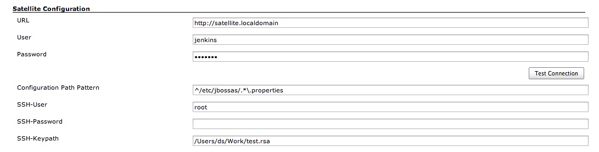
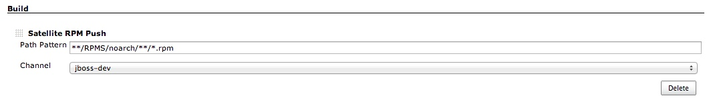
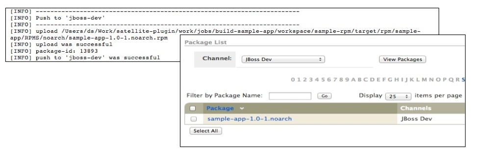

Jenkins Satellite Plugin
========================

Redhat Satellite (or Spacewalk) is a powerful system management tool. In many projects, we use Jenkins for continous build processes and RHN Satellite for distribution of created software packages. For this we used a combination of shell and python scripts, what works well - more or less ...  

But with this approach, Jenkins and their users was been given too much rights / permission to deal with the Satellite (for example, the Satellite has no fine-grained permissions for configuration channels). Some administrators were not happy about this facts...

Finally, to stop the sprawling scripting tool box, we had decided to develop this Jenkins plugin.

The plugin provides the following functions:

-  pushes packages (rpm's) in software channels (rpm's were build by the [maven-rpm-plugin](http://mojo.codehaus.org/rpm-maven-plugin/))
-  staging - copying packages between software channels
-  editing and updating configuration files from configuration channels
-  executing scripts on remote systems within a system group (via Satellite scheduling/osad or ssh)

The plugin does not use external programs, which means it can be used on any machine (without packages like rhnpush, spacewalk-backend-libs).

Installation
------------
Install the satellite.hpi like others plugins, see [here](https://wiki.jenkins-ci.org/display/JENKINS/Plugins#Plugins-Byhand)
  
Configuration
-------------
Configuration is done via the Jenkins main configuration page:

- with "Configuration Path Pattern" it is possible to limit access for files from config channels
- if ssh instead of satellite scheduling is used for remote commands, user and password/keyfile  for system access is required

Push Packages
-------------
There is a special build step to push new packages in an software channel.

- "Path Pattern" is the path to search for new RPM packages (is a ant-like pattern, no regular expression)

Staging Packages
-------------
todo ...

Updating Config Files
---------------------
todo ...

Executing Scripts
-----------------
todo ...

