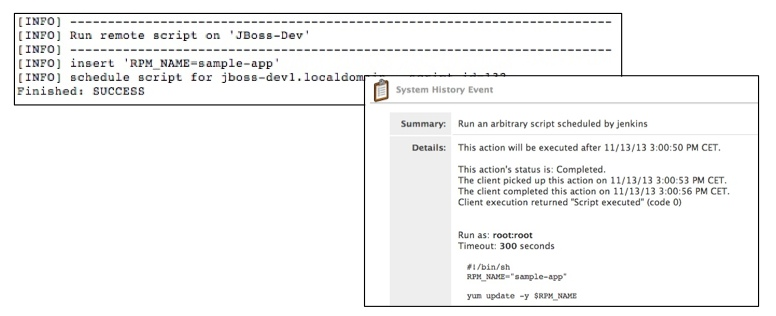

Jenkins Satellite Plugin
========================

Redhat Satellite (or Spacewalk) is a powerful system management tool. In many projects, we use Jenkins for continous build processes and RHN Satellite for distribution of created software packages. For this we used a combination of shell and python scripts, what works well - more or less ...  

But with this approach, Jenkins and their users was been given too much rights / permission to deal with the Satellite (for example, the Satellite has no fine-grained permissions for configuration channels). Some administrators were not happy about this facts...

Finally, to stop the sprawling scripting tool box, we had decided to develop this Jenkins plugin.

The plugin provides the following functions:

-  pushes packages (rpm's) in software channels (rpm's were build by the [maven-rpm-plugin](http://mojo.codehaus.org/rpm-maven-plugin/))
-  staging - copying packages between software channels
-  editing and updating configuration files from configuration channels
-  executing scripts on remote systems within a system group (via Satellite scheduling/osad or ssh)

The plugin does not use external programs, which means it can be used on any machine (without packages like rhnpush, spacewalk-backend-libs).

Installation
------------
Install the satellite.hpi like others plugins, see [here](https://wiki.jenkins-ci.org/display/JENKINS/Plugins#Plugins-Byhand)
  
Configuration
-------------
Configuration is done via the Jenkins main configuration page:

- with "Configuration Path Pattern" it is possible to limit access for files from config channels
- if SSH is used instead of Satellite Scheduling for executing remote commands, user and password/keyfile for system access

Push Packages
-------------
There is a special build step to push new packages in a software channel.

- "Path Pattern" is the path to search for new RPM packages (ant-like pattern, no regular expression)

The name of the pushed package is stored in the build variables with the key **RPM_PACKAGE** and can be used in other build steps (for example executing remote script).

Staging Packages
----------------
Staging (in this context) is the process when packets are copied from one channel to another. For if a application has passed all qualitiy assurance tests, then this package is ready for production and should be copied to the production software channel.

For such tasks we have an 'generic' build step **Satellite Task**. This build steps searches in the current build variables for knowing keys and performs the associated action. For creating such variables in a build we have some customized *build parameters*

To copy packages between software channel:  

- create a *parameterized build* and add a **Satellite Staging** parameter

- add the build step **Satellite Task**

- run **Build with parameters**  
before the build starts, it is now possible to select the package for staging

 

- the selected packet should be copied to the target channel

 
  
 

Updating Config Files
---------------------
Configuration files management is a nice feature of the RHN Satellite. Unfortunately, there are no different roles for editing of config channels.

**Satelllite User Management:**

With the encapsulation of editing configuration files in a build step, it is possible to use Jenkins User Management for reading/changing certain configuration files.  
This also works using a parameterized build:
 
- create a *parameterized build* and add a **Satellite Update Configuration** parameter

- add the build step **Satellite Task**

- run **Build with parameters**  
before the build starts, it is possible to edit the configuration file

- run as **Build with parameter**

Executing Scripts
-----------------
For executing of scripts on a system group (for example after pushing a new package version to an channel), there is the build step **Satellite Remote Script**.  

Here is an example to run an build step standalone or after an **Satellite Push**:

- create a *parameterized build* and add a **String Parameter** parameter

- add the build step **Satellite Remote Script**  
  use Satellite Schedule or SSH 

- run the build standalone (with parameter) or use it as an **Post Build Step** in other builds

